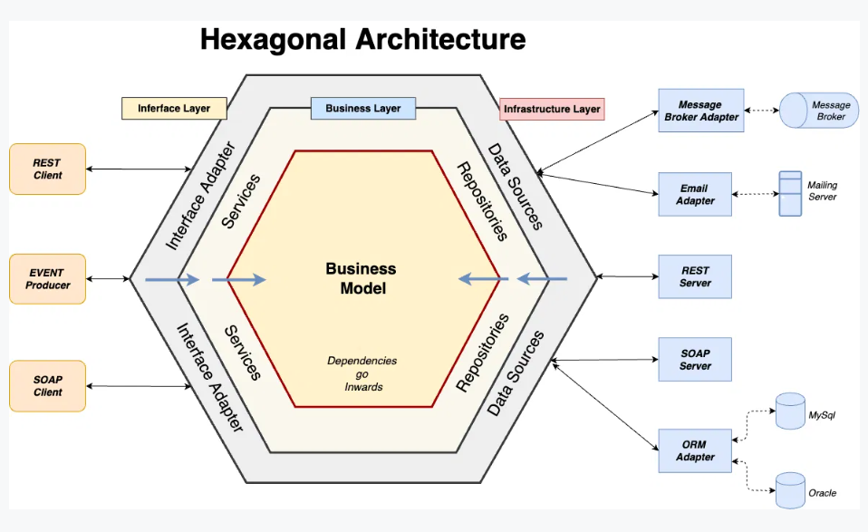

# TÀI LIỆU NGHIÊN CỨU HEXAGONAL ARCHITECTURE
**Họ và tên**: Đỗ Anh Quân

**Workflows:** Layered Questioning, Solution Exploration, Iterative Refinement

---

## MỤC LỤC
1. [Core Principles](#1-core-principles)
2. [Pros & Cons](#2-pros--cons)
3. [When to Apply](#3-when-to-apply)
4. [Alternatives](#4-alternatives)
5. [Workflows Applied - Track quá trình nghiên cứu với AI](#5-workflows-applied---track-quá-trình-nghiên-cứu-với-ai)
6. [Kết luận](#6-kết-luận)

---

## 1. CORE PRINCIPLES
### 1.1 Hexagonal Architecture là gì ?

**Hexagonal Architecture** (Ports and Adapters architecture) được tạo ra bởi Alistair Cockburn năm 2005 là một mẫu kiến trúc được dùng trong thiết kế phần mềm. Nó hướng tới việc xây dựng ứng dụng xoay quanh business/application logic mà không ảnh hưởng hoặc phụ thuộc bởi bất kì hành phần nào bên ngoài mà chỉ giao tiếp với chúng qua ports/adapters.

### 1.2 Vấn đề và giải pháp 

| Vấn đề | Giải pháp của Hexagonal |
|--------|------------------------|
| Business logic phụ thuộc vào framework | Domain core hoàn toàn độc lập |
| Khó kiểm thử vì cần database thật | Test với mock adapters |
| Khó thay đổi công nghệ | Sử dụng adapter mới |
| Code bị lẫn giữa các concern | Tách biệt rõ ràng qua Ports |

### 1.3 Kiến trúc tổng quan về Hexagonal Architecture 



### 1.4 Port trong Hexagonal Architecture
**Port** là một giao diện trừu tượng (interface) mà logic nghiệp vụ cốt lỗi (domain logic) sử dụng để giao tiếp với bên ngoài hoặc để bên ngoài giao tiếp với ứng dụng.

Nhiệm vụ của Ports là định nghĩa một ra một interface chuẩn, để các actor từ bên ngoài có thể giao tiếp được với Application, mà không cần quan tâm xem ai đang triển khai cái interface đó.

- Có 2 loại Port chính:
1. Inbound Port: Là các giao diện mà ứng dụng cốt lõi nhận dữ liệu từ bên ngoài.
2. Outbound Port : Là các giao diện mà ứng dụng cốt lõi gửi dữ liệu hoặc yêu cầu dữ liệu bên ngoài.

- Vai trò:
1. Tách rời (Decoupling): Cho phép domain logic không phụ thuộc trực tiếp vào hạ tầng hay các dịch vụ bên ngoài, dễ bảo trì và mở rộng.
2. Dễ kiểm thử (Testability): Domain logic tương tác thông qua interface nên việc mock các adapter khi test unit trở nên đơn giản hơn. 
3. Thay đổi: Có thể nâng cấp các adapter (ví dụ: đổi DB, REST API,.. ) mà không ảnh hưởng tới domain logic.

### 1.5 Adapter trong Hexagonal Architecture
**Adapter** là thành phần giúp kết nối core/domain với các hệ thống bên ngoài như cơ sở dữ liệu, API bên ngoài.

Một Adapter sẽ chủ động tương tác với Application thông qua một Port, và nó là nơi triển khai một technology cụ thể. Ví dụ như một REST controller chính là 1 Adapter cho phép một client giao tiếp được với Application.

Có thể tạo ra nhiều Adapter cho cùng một Port và không gây ra rủi ro hay ảnh hưởng gì đến bản thân các Port hay Application Core

### 1.6 Application trong Hexagonal Architecture
**Application** chính là phần core (lõi) của toàn bộ hệ thống. Bên trong nó chứa các Services có nhiệm vụ điều phối các chức năng hoặc các usecase của phần mềm. Nó cung là nơi chứa toàn bộ business logic (logic nghiệp vụ) được thể hiện thông qua các khái niệm như Enity, Value Object.

Application được mô tả bằng một hình lục giác. Hình lục giác này nhận các command hoặc query từ các Port đi vào, gửi các request ra các actor bên ngoài thông qua Port khác.

Khi được áp dụng cùng với Domain-Driven Design (DDD), phần Application sẽ bảo gồm Application layer và Domain layer. Các layer còn lại như các Interface và Infrastructure sẽ được triển khai bên ngoài hình lục giác đó.

## 2. PROS & CONS (Ưu điểm và nhược điểm)
### 2.1 Ưu điểm

| Ưu điểm | Mô tả | Ví dụ |
| --------| ----- | ----- |
| Testability  | Core có thể test hoàn toàn độc lập | Test business logic mà không cần database |
| Flexibility | Dễ dàng thay đổi infrastructure | Chuyển từ JSON file sang PostgreSQL chỉ cần tạo adapter mới |
| Maintainability | Code rõ ràng , sạch và dễ bảo trì | Mỗi thành phần đều có chức năng riêng , dễ bảo trì hoặc sửa lỗi khi có vấn đề |
| Domain Focus | Tập trung vào business logic | Domain không bị lẫn với framework |
| Parallel Development | Nhiều nhóm có thể làm việc độc lập | Team A làm CLI, team B làm web, team C là Database, ... |


### 2.2 Nhược điểm 
| Nhược điểm | Mô tả | Cách cải thiện |
| ---------- | ----- | ----------------------- |
| Complexity | Nhiều layer, interface | Chỉ áp dụng cho phần có domain phức tạp |
| Learning | Tương đối khó với các lập trình viên mới |  Training, code review, documentation, training and learn with AI |
| Overkill | Không phù hợp với các dự án nhỏ | Lưu ý và cân nhắc trước khi áp dụng | 


## 3. WHEN TO APPLY
### 3.1 Usecases phù hợp
A. Domain phức tạp , logic nghiệp vụ nhiều : Tính phí vận chuyển, lãi suất, khuyến mãi, ... 

B. Cần tích hợp nhiều hệ thống : Hỗ trợ nhiều loại Database, Multiple interfaces. 

C Dự án dài hạn, cần bảo trì nhiều : Chuyển giao code cho các dev sau, đảm bảo quality và testability cao, sản phẩm kéo dài và phát triển lâu. 

### 3.2 Các dấu hiệu nên dùng tới Hexagonal
A. Ứng dụng có business logic phức tạp
- Logic nghiệp vụ đặt làm trọng tâm
- Các thay đổi về framework, databasse hoặc các công nghệ khác bên ngoài không ảnh hưởng tới core logic.

B. Yêu cầu khả năng kiểm thử độc lập
- Ports and Adapters giúp dễ dàng tạo mock/stub cho các external systems
- Phân chia các chức năng rõ ràng , dễ bảo trì hoặc nâng cấp.
- Muốn kiểm thử mà không cần chạy database, UI hay server thật.

C. Cần tính mở rộng và bảo trì trong thời gian dài
- Tạo hệ thống có thể thêm, thay đổi hoặc thay thế các thành phần bên ngoài mà không làm thay đổi core.

D. Dự án lớn
- Giảm rủi ro xung đột code khi chia các chức năng riêng cho các nhóm riêng, tăng khả năng phối hợp.

E. Ứng dụng hướng Domain-Driven Design (DDD)
- Ports and Adapters giúp Application và Domain layer tách biệt khỏi Infrastructure và Delivery layer.

### 3.3 Khi nào không nên dùng tới Hexagonal
- Ứng dụng rất nhỏ, đơn giản, CRUD cơ bản , overhead không cần thiết.
- Team chưa quen với pattern , learning curve cao và có thể làm chậm phát triển ban đầu.
- Chỉ cần 1 adapter và một nguồn dữ liệu duy nhất, chưa tách port/adapters rõ ràng. 

## 4. ALTERNATIVES
### 4.1. Layered Architecture (Kiến trúc phân tầng)
1. **Định nghĩa:**: Chia ứng dụng thành các tầng xếp chồng lên nhau.

2. **Mô hình**

```
AI created

Presentation Layer (UI/Controllers)
        ↓
Application Layer (Services)
        ↓
Domain Layer (Business Logic)
        ↓
Infrastructure Layer (Database)
```

3. **So sánh với Hexagonal**

| Tiêu chí | Layered | Hexagonal |
| -------- | ------- | --------- |
| Dependency | Phân tầng | Hướng vào core | 
| Domain độc lập | Phụ thuộc vào tầng dưới | Độc lập | 
| Testability | Khó kiểm thử tầng dưới | Dễ kiểm thử vì đã phân chia rõ ràng |
| Thay đổi DB | Khó, gây ra nhiều ảnh hưởng | Chỉ cần tạo adapter mới |


4. **Khi nào dùng Layered:**
- Dự án CRUD đơn giản
- Không có kế hoạch thay đổi hạ tầng
- Team đã quen thuộc với pattern này 

### 4.2 Clean Architecture
1. **Định nghĩa:** Mở rộng từ Hexagonal , thêm nhiều layer và rules chi tiết hơn. 

2. **Mô hình** 
```
AI created

Entities (Enterprise-wide)
    ↓
Use Cases (Application-specific)
    ↓
Interface Adapters (Controllers, Presenters, Gateways)
    ↓
Frameworks & Drivers (DB, UI, External)
```

3. **So sánh với Hexagonal**

| Tiêu chí | Clean | Hexagonal |
| -------- | ----- | --------- |
|Số layer | 4 layer chính | 3 thành phần chính |
| Độ phức tạp | Rất cao | Cao


4. **Khi nào dùng Clean**
- Hệ thống cực ký lớn và phức tạp
- Yêu cầu hệ thống bảo trì cực cao
- Nhiều team, nhiều module


### 4.3 MVC Pattern (Model - View - Controller)
1. **Định nghĩa:** Pattern phổ biến cho web applications.

2. Mô hình

```
AI created

Model (Data + Business Logic)
    ↕
Controller (Xử lý request)
    ↕
View (Hiển thị UI)
```

3. **So sánh với Hexagonal**
| Tiêu chí | MVC | Hexagonal |
| -------- | --- | --------- |
| Testability | Trung bình | Cao |
| Mục đích | Tách UI khỏi data | Tách business khỏi infrastructure |
| Phạm vi | Web apps | Mọi loại ứng dụng |
| Domain isolation | Model bị phụ thuộc | Domain hoàn toàn độc lập |

4. **Khi nào dùng MVC**
- Web applications truyền thống 
- Dự án nhỏ phù hợp trong việc học tập
- Không quá phức tạp.

## 5. WORKFLOWS APPLIED - Track quá trình nghiên cứu với AI

### 5.1 Prompt 1 - Research:

- Yêu cầu AI giải thích chi tiết về Hexagonal Architecture:

1. Định nghĩa
2. Các thành phần chính 
3. Sơ đồ kiến trúc
4. Nguyên lý hoạt động


=> AI đưa ra các định nghĩa giải thích về Hexagonal Architecture , đưa ra 3 thành phần chính bao gồm: 
1. Core/Domain: Business logic thuần túy
2. Ports: Interfaces định nghĩa cách core giao tiếp
3. Adapters: Implementations cụ thể cho từng công nghệ
Sau đó AI đưa ra sơ đồ kiến trúc và nguyên lý hoạt động.


### 5.2 Prompt 2 - Brief Feature:

- Đặt ra câu hỏi ví dụ như: Tôi đang muốn xây dựng một CLI tool quản lý tickets.
- Làm thế nào để tôi có thể áp dụng với Hexagonal Architecture ? Mapping từng folder như nào ? 
- Đưa ra cấu trúc dự kiến

Ví dụ: 
```
src/
  commands/     # CLI commands
  services/     # Business logic
  repositories/ # Data access (JSON file)
  models/       # Domain models
  utils/        # Helpers
```

=> AI đưa ra câu trả lời theo yêu cầu:
```
Với CLI tool của bạn, có thể tổ chức lại như sau:

src/
  domain/           # CORE - Không phụ thuộc gì
    entities/       # Ticket.ts (thuần business)
    services/       # TicketService.ts (use cases)
    
  ports/            # PORTS - Interfaces
    inbound/        # TicketService.ts (driving port)
    outbound/       # TicketRepository.ts (driven port)
    
  adapters/         # ADAPTERS - Implementations
    primary/        # CLIAdapter.ts (driving adapter)
    secondary/      # FileSystemRepository.ts (driven adapter)

Cách mapping:
- commands/ → primary adapters (CLI)
- services/ cũ → domain services (core)
- repositories/ cũ → secondary adapters + ports
- models/ cũ → domain entities
```

### 5.3 Prompt 3 - Code Example
- Đưa ra câu hỏi ví dụ : Liệu AI có code example hoàn chỉnh cho tôi về Ticket entity bằng typescript ở vấn đề nếu trên không ?
- Đưa ra các properties (id, title, description, status, priority, tags, ..)
- Yêu cầu các business methods : updateStatus, addTag, isHighPriority


=> AI đưa câu trả lời:
```typescript
// domain/entities/Ticket.ts
export type TicketStatus = 'open' | 'in-progress' | 'review' | 'closed';
export type TicketPriority = 'low' | 'medium' | 'high' | 'critical';

export class Ticket {
  constructor(
    public id: string,
    public title: string,
    public description: string,
    public status: TicketStatus,
    public priority: TicketPriority,
    public tags: string[],
    public createdAt: Date,
    public updatedAt: Date
  ) {}

  updateStatus(newStatus: TicketStatus): void {
    if (this.status === 'closed' && newStatus !== 'closed') {
      throw new Error('Cannot reopen closed ticket');
    }
    this.status = newStatus;
    this.updatedAt = new Date();
  }

  addTag(tag: string): void {
    if (!this.tags.includes(tag)) {
      this.tags.push(tag);
    }
  }

  removeTag(tag: string): void {
    this.tags = this.tags.filter(t => t !== tag);
  }

  isHighPriority(): boolean {
    return this.priority === 'high' || this.priority === 'critical';
  }

  isOverdue(days: number = 7): boolean {
    if (this.status === 'closed') return false;
    const ageInDays = (Date.now() - this.createdAt.getTime()) / (1000 * 60 * 60 * 24);
    return ageInDays > days;
  }
}

```


### 5.4 Prompt 4 - Validation
- Đặt ra vấn đề là với đoạn code bạn vừa gửi ở trên làm sao để tôi có thể kiểm thử?
- Các edge cases nào cần xử lý ?
- Làm sao để mock repo khi test service ?


=> AI trả lời: 
```typescript
// Test entity - dễ dàng vì không có dependencies
describe('Ticket', () => {
  it('nên update status hợp lệ', () => {
    const ticket = createTestTicket();
    ticket.updateStatus('in-progress');
    expect(ticket.status).toBe('in-progress');
  });

  it('không nên update status khi đã closed', () => {
    const ticket = createTestTicket({ status: 'closed' });
    expect(() => ticket.updateStatus('open')).toThrow();
  });
});

// Edge cases cần xử lý:
// - Title/description empty
// - Status transition không hợp lệ
// - Tags trùng lặp
// - Priority không hợp lệ

// Mock repository pattern:
class MockTicketRepository implements TicketRepository {
  private tickets = new Map();
  
  async save(ticket: Ticket) {
    this.tickets.set(ticket.id, ticket);
  }
  
  async findById(id: string) {
    return this.tickets.get(id) || null;
  }
}

```

### 5.5 Prompt 5 - Solution Exploration
- Đặt ra vấn đề: với dự án trên tôi đang muốn làm việc với team từ 2 đến 3 người, cần dễ kiểm thử, lưu dữ liệu hiện tại là JSON và có thể chuyển đỏi sau, dự án CLI tool quản lý tickets, có thể mở rộng thành web app sau thì tôi nên chọn pattern nào ? tại sao ? 

=> AI trả lời:
```
Tôi recommend **Hexagonal Architecture** vì:

1. **Testability**: Với business logic có thể phức tạp sau này, test rất quan trọng
2. **Future-proof**: Dễ dàng chuyển từ CLI → Web, từ JSON → Database
3. **Domain focus**: Tickets có thể có nhiều rules (status flow, priority, tags)
4. **Team size**: 2-3 dev có thể học và áp dụng được

Rủi ro cần lưu ý:
- Overhead ban đầu: Cần thiết kế ports cẩn thận
- Learning curve: Dành thời gian training

Giải pháp: Bắt đầu với Hexagonal ngay từ đầu, nhưng chỉ implement những gì cần thiết.
```

### 5.6 Interative Refinement
- Dựa vào những giải pháp cũng như code mà AI đề xuất:
1. Đặt ra câu hỏi cho mình: Đã đúng theo yêu cầu hay chưa, đã đủ hay chưa.
2. Nếu như thiếu yêu cầu, code sơ sài, code tự giả lập đúng => đặt câu hỏi cho AI: tôi đã xem và phát hiện ra vấn đề này (Đưa ra các vấn đề)
3. Refine code và nhờ AI review lại.
4. Sau khi AI review sẽ đề xuất các phương án khác nếu cần.
5. Refine tiếp nếu cảm thấy các phương án đó phù hợp.
6. Lặp đi lặp lại các vấn đề cho đến khi đạt được đúng mục đích mà mình đã đề ra cho AI từ đó AI có thể học máy cho các lần tới khi mình cần yêu cầu phát triển một ứng dụng tương tự như vậy


## 6. Kết luận
- Qua quá trình nghiên cứu và áp dụng các workflows, bạn sẽ hiểu được hơn về cách vận hành đối với các dự án lớn thông qua Hexagonal Architecture:
1. Giúp phát triển và hiểu được hơn về cách vận hành với logic nghiệp vụ bằng cách cô lập, dễ kiểm thử, dễ bảo trì
2. Testability cao nhưng complexity cũng cao.
3. Phù hợp với các dự án có domain khá phức tạp, cần maintain lâu dài.
